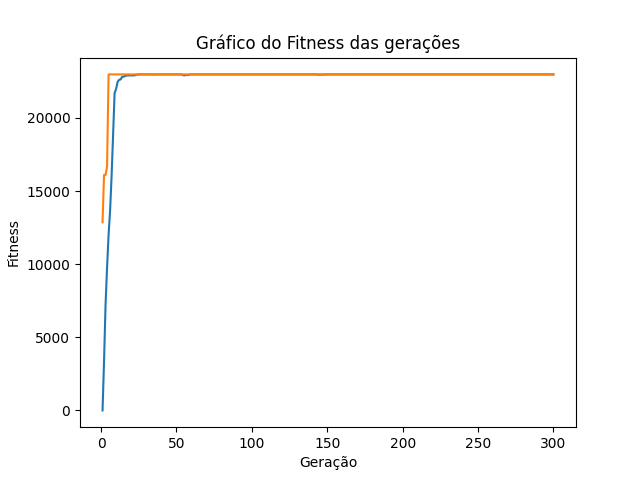

# ProjetoIntegrador_III

This project was developed in university. I'ts a genetic algorith written in python to discover maximum and minimun of mathematical functions.

The graph below shows an example of the algorith working for the mathmatical function: 5x² + 50x - 20

;